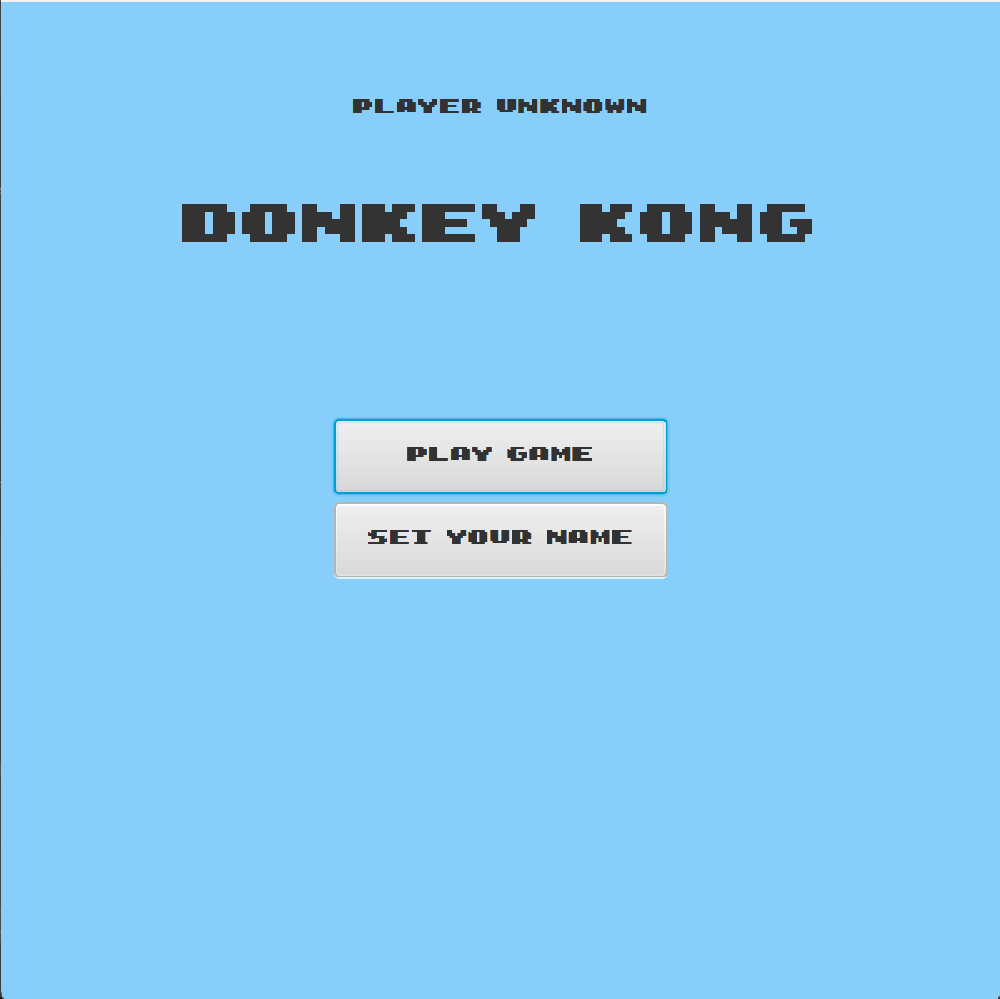
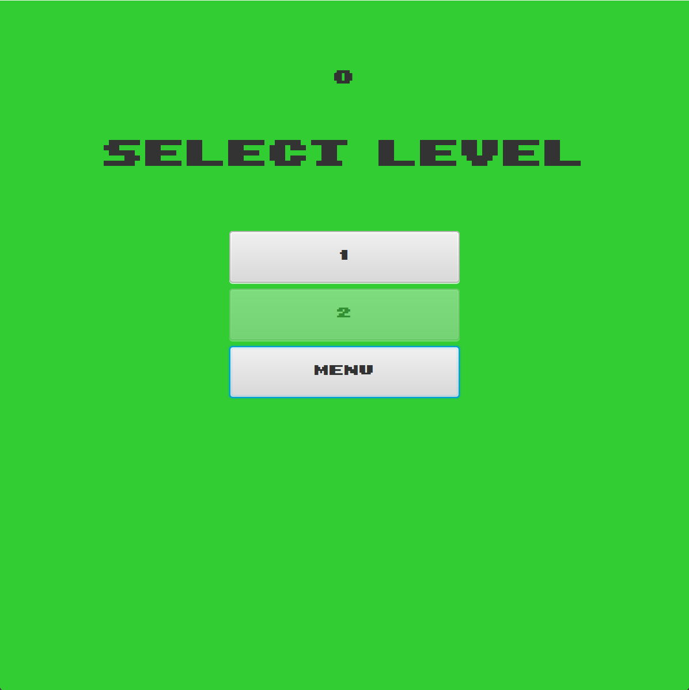
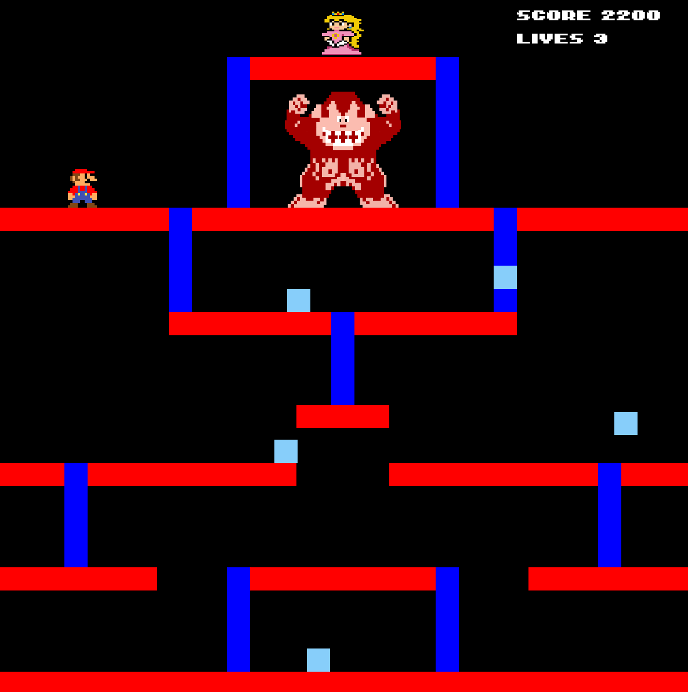

# Donkey Kong

Game inspired by [Donkey Kong](https://en.wikipedia.org/wiki/Donkey_Kong_(arcade_game)).
It is not 1 to 1 clone, game is only inspired and some things could be different from the original game.
Game is written in Java and UI library is JavaFx. The intention for the development was school project to JAVA 1 on [VŠB FEI](https://fei.vsb.cz).
Even if the school project is submitted, I hope that I will be able to deliver new features and levels.

## Known problems

### Missing assets
I haven't found a good resource for game assets. Therefore, some objects are represented only by the rectangle. 
If you have some tips on resources, or you are able to create the assets you can contact me.

## GUI

### Main menu

At the top you can se your name. If you haven't set your name yet, I can set when you click on **SET YOUR NAME** button.
When you set your name your game progress is saved in file. 
If you want to play game click on the button. After click, you will se level list;

### PLAY GAME

At the top you can see sum of your all best scores. You have to pass previous level to unlock another.
When you want to go back you have to click on **MENU** button.

## GAME

In the picture above you can se game UI. You can se your current score and lives. 
You win the level when you meet a princess peach. And game over is when your live is 0.
The keyboard layout is classic **WASD** for movement and **SPACE** for JUMP.
The Score is decrementing during the time, so if you want the best score you have to pass level as fast as you can.

### Future

1. I want to add better assets. The current status is only due to deadline of school project
2. Add more enemies. In original game you there are more types of enemies and I want to add them.
3. Add hammer or some kind of weapon. Mario have some kind of weapon in the game to destroying the enemies.
4. More complex objects. In original game there are more complex objects in the game.
